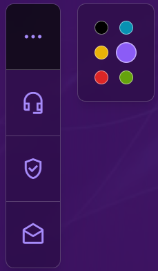
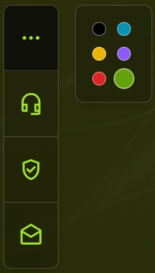
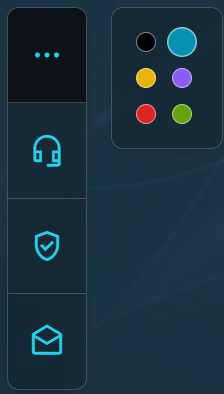

# Tailwind Form

This project demonstrates a form using Tailwind CSS with the following features:
- To start this project download the zip and doubleclick index.html
## 1.Color Change Window:
- 6 different themes are available for selection.

-       

    | *Purple theme*    | *Green theme*            | *Turquoise theme*            |

## 2.Form:
- Autocomplete on form inputs.
- Active window highlighting on mouse click.
- Hover effects on buttons.

## 3.Visual Verification Window

## 4.Email Subscription Window:
- Autocomplete on form inputs.
- Active window highlighting on mouse click.
- Hover effects on buttons.

